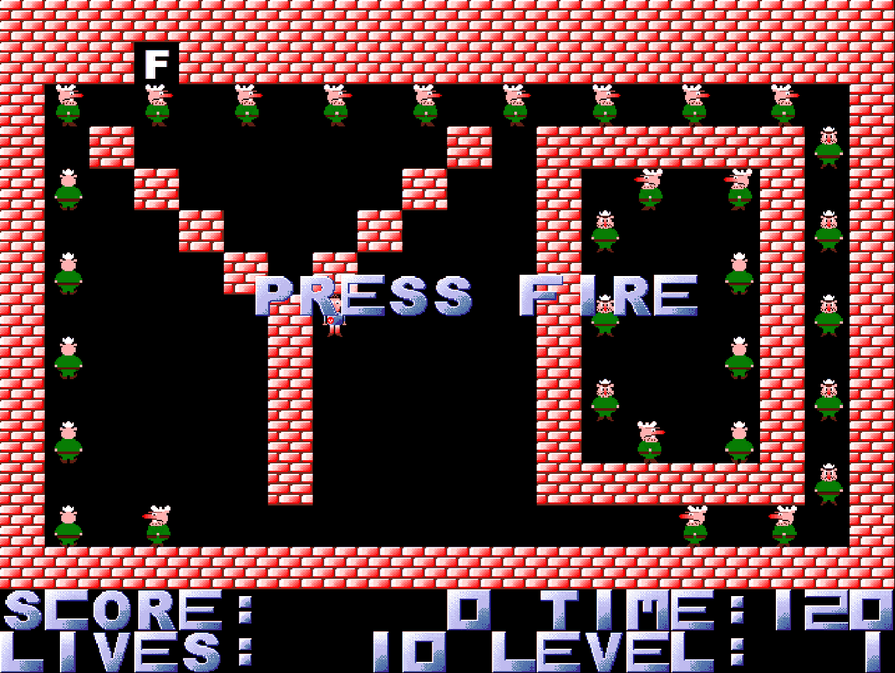
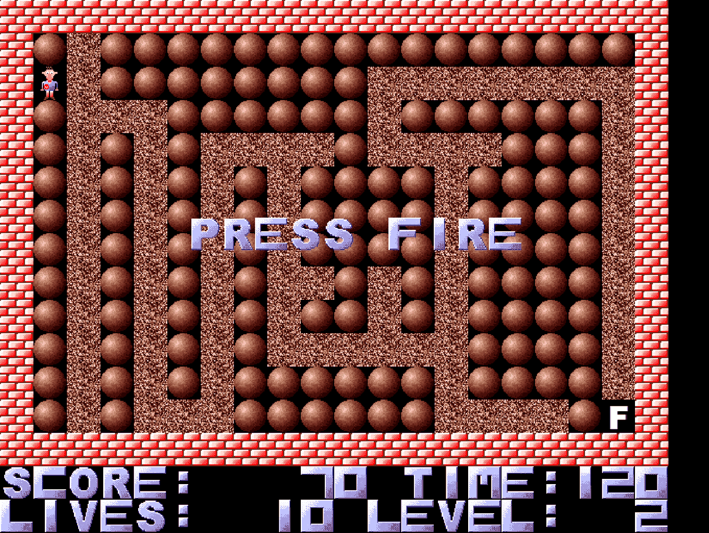
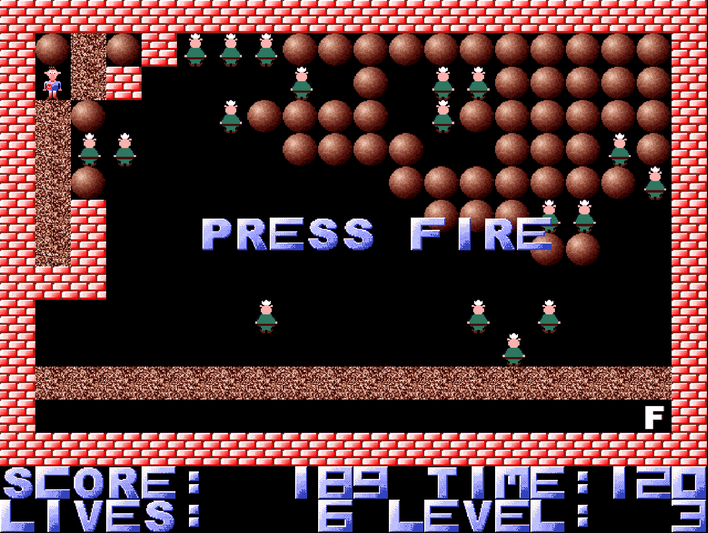
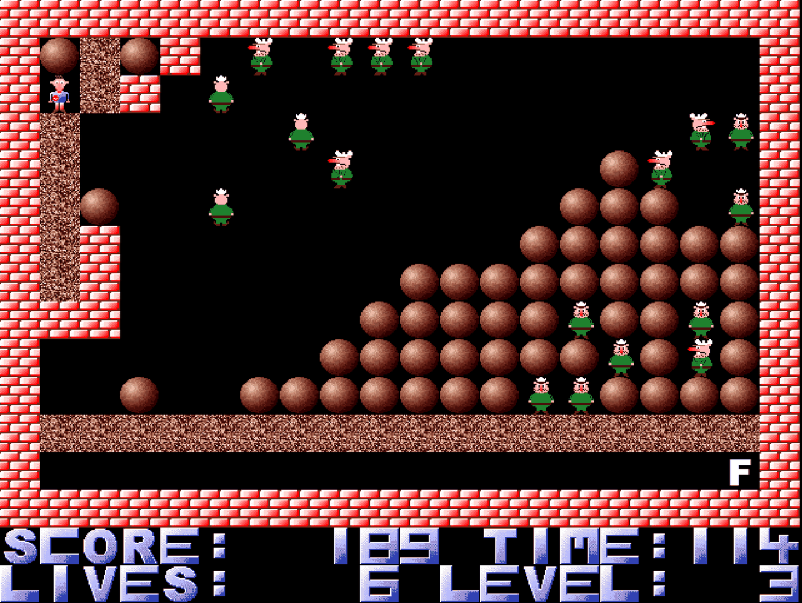

# Amiga_WernerAGA

WernerAGA, my first larger game written in Motorola 68K Assembler, back in 1995. Needs Amiga OS3 and AA Chipset.

**▶ [Play it in your browser](https://patman77.github.io/Amiga_WernerAGA/web/)** — no Amiga required. See [`web/`](web/) for the port.

Werner has to reach the bottle — the white **F** — before the clock runs out, on a
20×14 grid of walls, dirt, stones and cops. Dirt gets eaten as he walks through
it; walls and stones block him, and he cannot push them. The cops walk with one
hand on the wall, so they endlessly circle whatever they are standing next to;
touching one, being hit by a falling stone or letting the time run out costs a
life. Every solved level adds the remaining seconds to the score and grants a
life back. Above: level 1, whose walls spell **YO**.

| Level 2 — a maze of dirt between the stones | Level 3 — the stones are still stacked |
|---|---|
|  |  |

Stones fall the moment nothing holds them up, and roll off sideways when they
come to rest on another stone — so digging out the wrong tunnel brings the whole
pile down on you, and on the cops:

Fun facts:

1. Some levels are so hard that I couldn't even manage to solve them by myself. One idea for today's deep learning era would be to apply the techniques from "Playing Atari with Deep Reinforcement Learning" to this little game. Pull request, anyone? Seriously, we need something for the Amiga as well ;-)
2. I painted everything (the main character, the cops, the stones etc.) by myself, but I have never drawn the bottle: it's a stylized pictogram showing a white "F" (German word "Flasche" for bottle). Proposals for better graphics welcome.
3. Whoever wants to build this: I used the "O.M.A 2.0 Macro Assembler" in those days.
